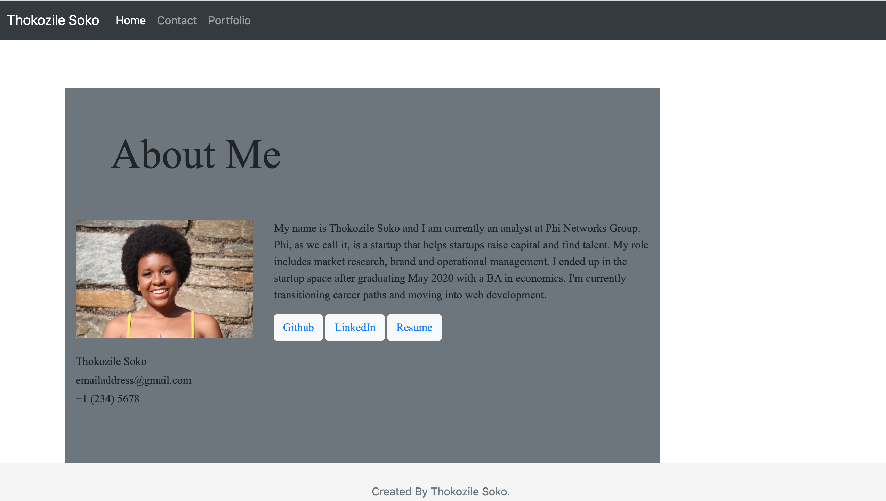
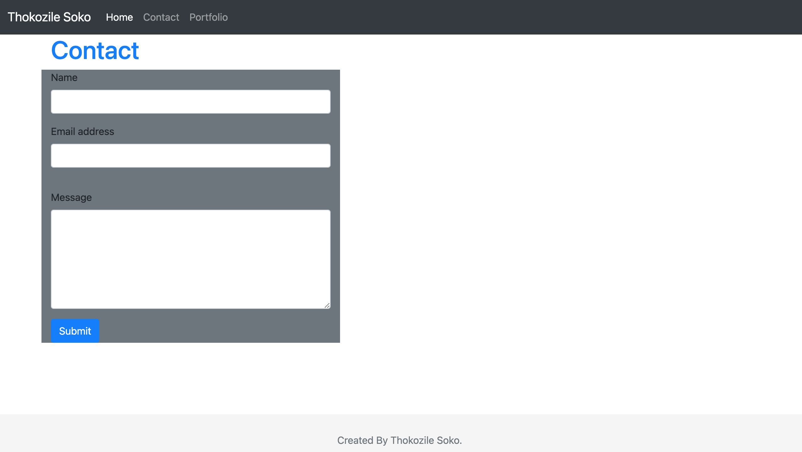
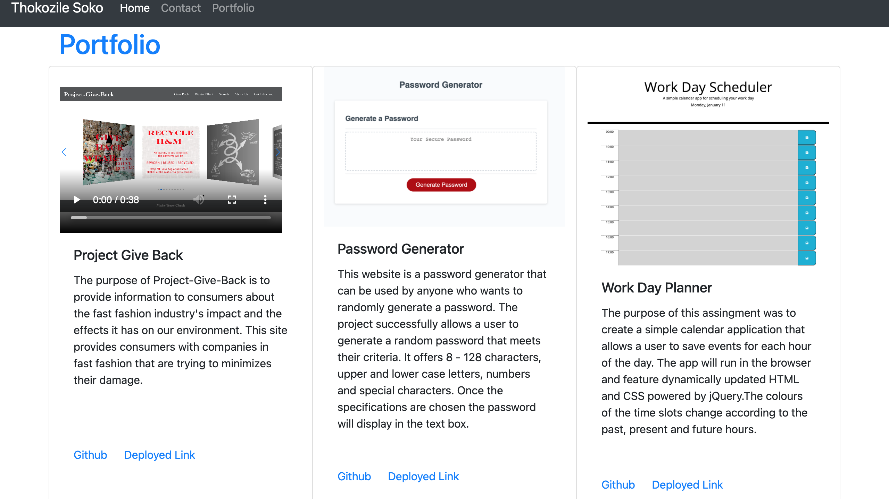

# Responsive Portfolio

Project: The project was the create a personal website as both a location for future employers to look at but also to create responsive pages.

In this respository are 4 created files. The files consist of index.html = About, contact.html = Contact, portfolio.html = Portfolio and a style.css file. The first three files were created without code and utilize the strengths of Bootstrap for the majority of their features. They all share uniform navbars and footers.

About:
In this html resides the home/about page of my personal website. On the page is a small box of information about me. These were created using rows and columns to move elements around on the page. 

Deployed Link: https://tasoko.github.io/Portfolio-HW/index.html

Technologies Used: 
HTML
Javascript
CSS
API

Contributors: 
Tom Rumore
Wendy Figueroa 

Contact:
In this html resides a form. On this form a user can write their name and email as well as a message they would want me to receive. 

Portfolio:
In this html resides 3 images for my portfolio. 

Style.css:
This file holds some personal style changes I made.
